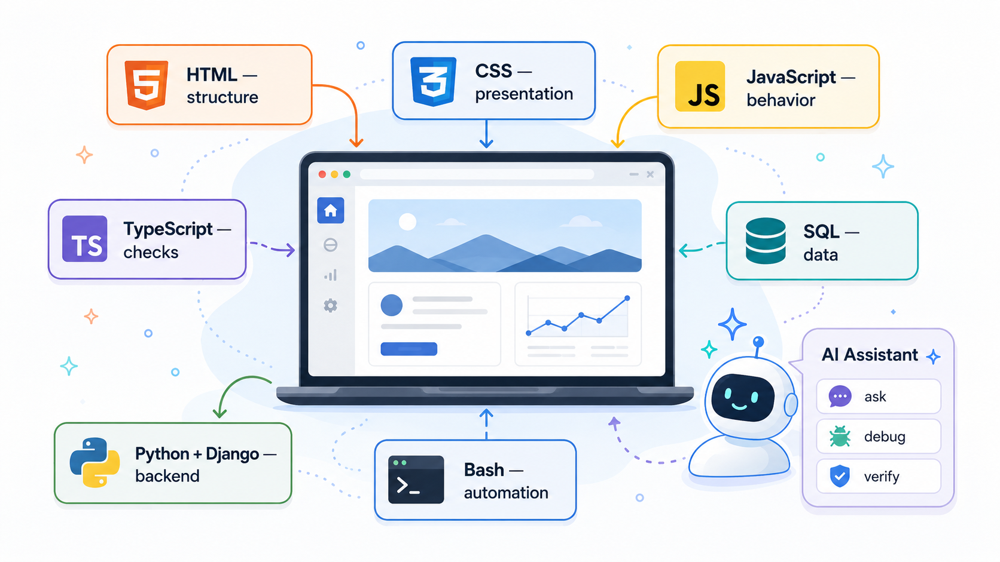

# Web Development Is a Conversation Between Several Languages

Web development is not one language. It is a conversation between several.

That is one reason learning web development can feel confusing at first. A beginner may open a tutorial expecting to “learn web development” and quickly run into HTML, CSS, JavaScript, TypeScript, SQL, Python, Django, Bash, Git, HTTP, JSON, databases, browsers, servers, terminals, packages, and deployment. It can look like a pile of unrelated tools.

But each language or technology has a job. Once you understand those jobs, the stack becomes much less mysterious. That is why my book, *Web Dev with an AI Sidekick*, teaches nine core technologies before asking you to build a complete project. The aim is not to turn every reader into an expert in every language immediately. The aim is to give readers enough fluency to understand what each part contributes, how data moves through a web application, and where AI can help without doing the thinking for them.

## HTML gives the page structure

HTML is the language of content and structure.

It describes the meaningful content of a web page: headings, paragraphs, links, images, forms, tables, lists, buttons, and sections. Before a page can be styled or made interactive, it needs structure. That structure matters because a browser, search engine, screen reader, or automated test tool needs to understand what the page contains. HTML is not decoration. It is the skeleton of the page.

A beginner who skips properly learning HTML, or treats it as something trivial, often struggles later. Poor structure makes CSS harder. It makes JavaScript harder. It makes accessibility harder. It makes testing harder.

AI can generate HTML quickly, but learners still need to ask basic questions like:

- Does this page have a sensible heading structure?

- Is this button really a button, or has AI produced a clickable `
`?

- Will this form make sense to a screen reader?

- Are the elements chosen for meaning, or just appearance?

These are the kind of questions that help a learner build good habits early.

## CSS gives the page presentation style

CSS controls how the page looks. It handles layout, spacing, colors, typography, responsive design, and visual hierarchy. It decides whether a form feels usable, whether a navigation bar fits on a phone, and whether a page looks calm or chaotic.

CSS can frustrate beginners because small changes sometimes have unexpected effects. A learner changes one rule and suddenly a button moves, a menu overlaps, or a layout collapses. This is where AI can be helpful, especially when it explains why a layout behaves the way it does.

But CSS is still worth learning properly. If you only copy styles from AI, you may get a page that looks acceptable without understanding how it works. That becomes a problem when you need to adjust it.

## JavaScript adds behavior

JavaScript brings the page to life. It can respond to clicks, validate form input, fetch data from a server, update part of the page, and handle small pieces of application logic in the browser. It is often the first language where beginners feel they are making the page *do* something.

JavaScript has its rough edges. It has a long history, a flexible type system, and plenty of old examples online that still work but are not always good models for new code. AI can help explain these differences, especially when learners encounter several ways to do the same thing.

A learner may see `var`, `let`, and `const` in different examples. They may see old DOM code beside newer approaches. They may see callbacks, promises, and `async`/`await`.

AI can help sort that out, but only when the learner knows what to ask. My book uses AI as a study partner for exactly this kind of confusion: “Why does this work?”, “Is this older style?”, “What could go wrong here?”, and “How would I test this?”

## TypeScript adds checks before the browser runs the code

TypeScript builds on JavaScript by adding static types. That means it can catch many mistakes before the code runs in the browser. It can tell you when you passed the wrong kind of value, forgot a property, or misunderstood the shape of an object.

For learners, TypeScript seems unnecessary at first. But it teaches a useful habit: being explicit about what data looks like. That habit is valuable across the whole stack. Web applications move data constantly: from forms to browser code, from browser code to the server, from the server to the database, and back again. If the shape of that data is vague, bugs appear.

## SQL stores and retrieves data

Most useful web applications need data. SQL is the language used to create, query, update, and delete information in relational databases. It lets a web application store users, products, orders, survey questions, answers, comments, settings, and much more.

SQL is a good language for beginners to meet because it is direct. You ask for data. You filter it. You sort it. You join related tables. You count things. You update records. That is especially useful in a web development book because databases are where many design decisions become visible. A poorly designed table can make the rest of the application awkward. A missing relationship can force messy code later. A badly written query can return the wrong results.

AI can help write SQL, explain joins, and diagnose query problems. But learners need to know enough to ask, “Is this query returning the right rows?” rather than only asking, “Does this query run?”

## Python and Django handle backend logic

Python is used in the book as the main backend programming language. Python is readable, widely used, and a good fit for teaching backend concepts. It allows learners to focus on ideas such as functions, data structures, modules, requests, responses, and application logic without too much syntactic noise.

Django then gives that Python code a web application structure. It handles routing, views, templates, models, forms, authentication, administration, and database access. Django can seem large at first, but it gives learners a practical way to build a real application without inventing every part themselves.

This is where the frontend and backend connect. A browser sends a request. Django receives it. Python code decides what should happen. The database may be queried. A response is returned. The browser displays the result.

Once learners understand that cycle, web development becomes easier to navigate. Errors also become easier to locate. Is the problem in the HTML? The CSS? The browser JavaScript? The Django view? The model? The database query? The URL route?

AI can help investigate those questions, but the learner needs a map of the territory. The book gives them that map by introducing each part before combining them.

## Bash helps automate the work

Web development is not only writing application code. You also run commands. You create folders. You install packages. You start development servers. You run tests. You manage files. You inspect output. You use Git. You prepare projects for deployment. Bash, or shell scripting more generally, helps with that side of the work.

A beginner does not need to become a shell expert on day one. But they do need to become comfortable with the command line. It is where many real development tasks happen.

AI can be very useful here because command-line errors often look unfriendly. A learner can paste an error message into an AI tool and ask for an explanation in plain language. But they should still understand what a command is doing before running it, especially if it modifies files, installs software, changes configuration, or deletes anything.

## Why teach several technologies before the project?

Some books and courses try to hide the complexity of web development for as long as possible.

That can make the early lessons feel easier, but it often creates a bigger shock later. The learner eventually discovers that a real web application is not only a page, or only a script, or only a database. It is a system made from several cooperating parts.

*Web Dev with an AI Sidekick* takes a better route. It introduces the main pieces first, then brings them together in a project.

That project is a survey application. A survey app is a useful teaching project because it needs the same kinds of features found in many real systems:

- Forms for entering data.
- Validation to check that data.
- Pages for viewing and managing information.
- A database for storing questions and responses.
- Backend logic for deciding what should happen.
- Frontend code for making the experience usable.
- A development process that includes testing, debugging, and revision.

It is small enough to understand, but real enough to expose the connections between the technologies.

## Where AI fits

AI does not remove the need to learn HTML, CSS, JavaScript, TypeScript, SQL, Python, Django, or Bash.

It changes how a learner can approach them. A learner can ask AI to explain an error message, compare two code examples, suggest a test case, review a function, describe a database query, or explain why a page is not behaving as expected.

That is useful because programming is full of small moments where learners get stuck. Historically, those moments could waste hours. A missing quote, a wrong selector, a misunderstood error, or a database query returning no rows could stop progress completely. AI can help learners keep moving.

But the learner still has to verify. They still have to read the code. They still have to test the result. They still have to decide whether the answer fits the application they are building.

That is the main point of the book’s approach: AI can help you learn web development by making the stack more explainable. It can answer questions at the moment you have them. It can help you debug while the confusion is fresh. It can help you compare alternatives. It can help you check your understanding.

It does not make the need to learn the full web stack disappear. And honestly, that is a good thing. The web stack is fragmented because it has grown around many different jobs: documents, layout, interaction, data, servers, automation, deployment, and collaboration. Learning web development means learning how those jobs fit together.

Book link: [https://www.amazon.com/dp/180611125X/](https://www.amazon.com/dp/180611125X/)
