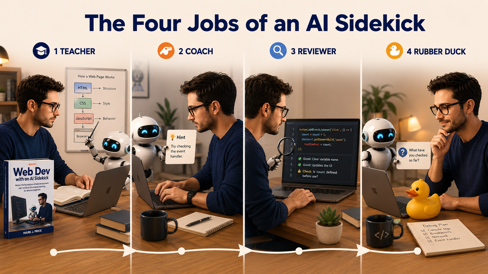
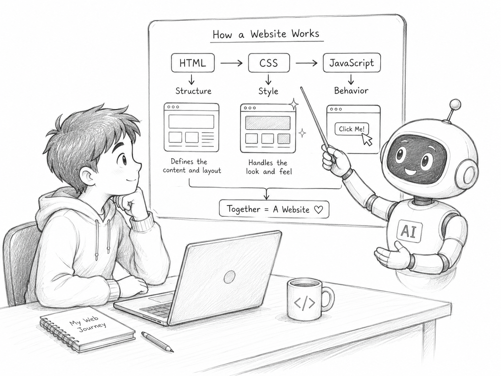
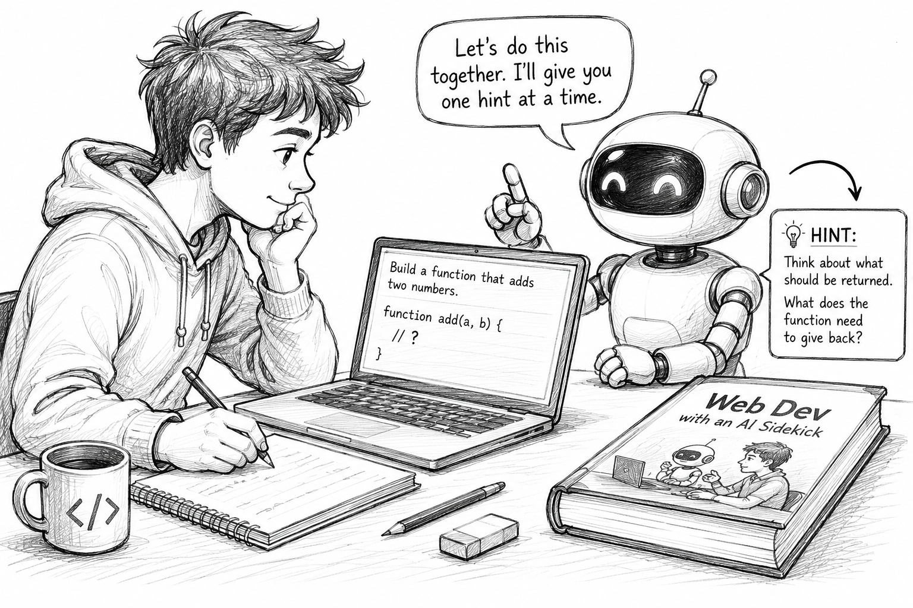
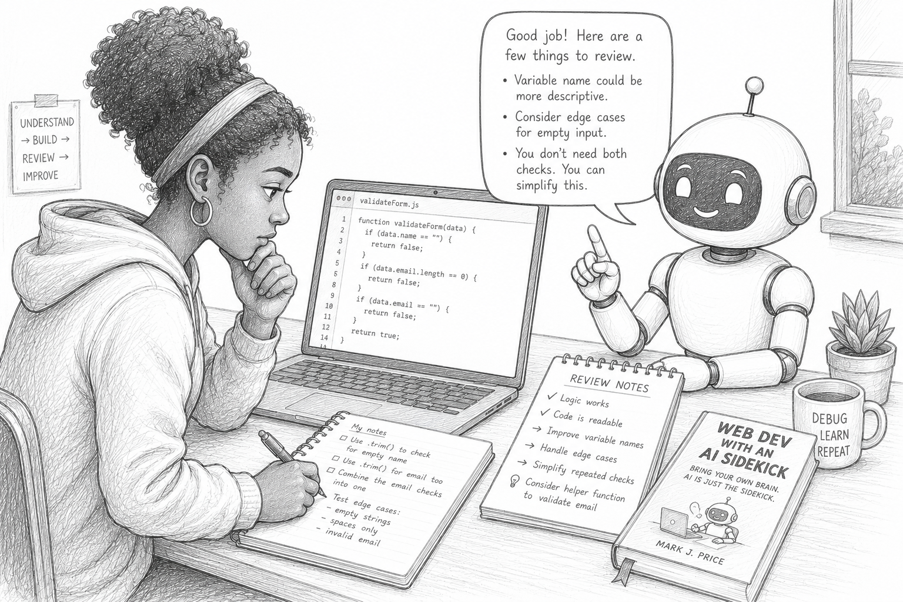
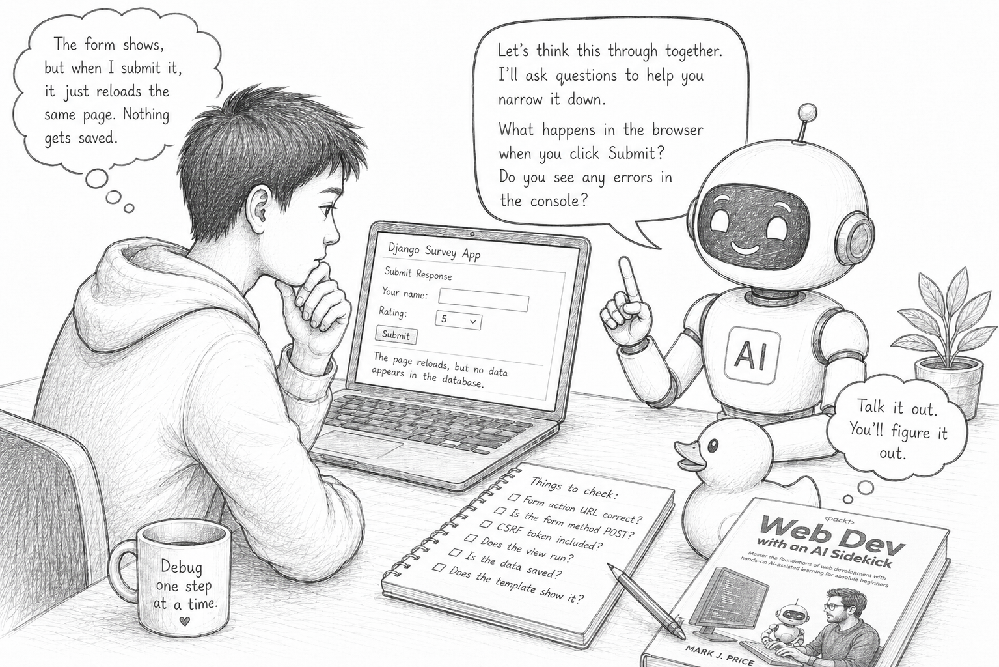

# The Four Jobs of an AI Sidekick

- [The Four Jobs of an AI Sidekick](#the-four-jobs-of-an-ai-sidekick)
  - [1. Teacher: explains concepts](#1-teacher-explains-concepts)
  - [2. Coach: gives practice and hints](#2-coach-gives-practice-and-hints)
  - [3. Reviewer: checks your work](#3-reviewer-checks-your-work)
  - [4. Rubber duck: helps you think through a problem](#4-rubber-duck-helps-you-think-through-a-problem)
  - [Choosing the right job](#choosing-the-right-job)
  - [A better pattern for learners](#a-better-pattern-for-learners)

A useful AI coding assistant has different jobs at different stages of learning.

Sometimes it should explain a concept. Sometimes it should give you a hint. Sometimes it should check your work. Sometimes it should sit there while you talk through the problem and realize what you missed halfway through the explanation.

A poor use of AI treats it as a vending machine for code. Put in a vague request. Get back a block of code. Paste it. Hope it works. Move on, slightly faster and slightly less informed.

That is risky for experienced developers and worse for beginners. If you are learning web development, your job is not only to produce code. You need to understand the code well enough to change it, test it, debug it, and explain it.

That is the approach behind *Web Dev with an AI Sidekick*. The book uses AI throughout the learning process, but not always as a code generator. The reader builds skills, then uses AI to explain, practise, review, debug, and extend what they are learning.

Here are four jobs an AI sidekick can do well when you are learning to code.

## 1. Teacher: explains concepts

The teacher role is useful when you meet a new idea and need an explanation that fits your current level.

This is especially useful in web development because the stack is wide. A beginner may move from HTML to CSS to JavaScript to SQL to Python to Django in a single course. Each part has its own vocabulary.

AI can help by giving a smaller example, explaining an error message, comparing two ideas, or translating a technical paragraph into language a beginner can work with.

But there is a catch. If you ask a vague question, you often get a vague answer. The answer may sound helpful, but it can drift into broad summary instead of helping you with the thing you are studying.

Bad prompt:

> Explain JavaScript.

Better prompt:

> I am learning JavaScript after HTML and CSS. Explain variables, functions, and event handlers using a small web page example. Keep the explanation suitable for a beginner and do not introduce frameworks.

The better prompt gives the AI four useful pieces of context: 
1. your level, 
2. what you already know, 
3. the specific concepts you want explained, and 
4. what to leave out.

Another bad prompt:

> What is Django?

Better prompt:

> I know basic Python functions and dictionaries. Explain what Django does in a web application. Use the path from browser request to Python view to HTML response. Keep it short and include one tiny example.

This is a good teacher prompt because it names the bridge you need. You are asking for help connecting something new to something you already know.

When using AI as a teacher, ask for explanations that match the chapter, lesson, or exercise in front of you. If the answer introduces too much, ask it to simplify.

Useful teacher prompts:

> Explain this concept using only HTML and CSS. Do not use JavaScript yet.

> Explain this error message in plain English. Do not fix the code yet.

> Give me a smaller example of the same idea.

> Compare `let` and `const` using examples a beginner would actually write.

> Explain this SQL query using the table names and column names in my code.

The teacher role is not about replacing the book, the course, or the tutor. It gives the learner another way into the material at the moment confusion appears.

## 2. Coach: gives practice and hints

The coach role is different from the teacher role. A teacher explains. A coach makes you do the work.

This is where AI can be excellent for beginners, if used carefully. It can generate practice tasks, give hints, ask follow-up questions, and nudge you toward the next step without handing over the final answer.

The trick is to ask AI to withhold the answer.

Bad prompt:

> Write a CSS layout for this page.

Better prompt:

> I am practising CSS Flexbox. Give me a small layout challenge with a header, sidebar, main content area, and footer. Do not show the solution until I ask. After I try it, review my CSS and give me one hint at a time.

That prompt turns AI into a coach. The AI creates a practice exercise for you, waits for your attempt, and gives feedback gradually.

Another bad prompt:

> Make me better at SQL.

Better prompt:

> Give me five beginner SQL practice questions using a table called `SurveyResponses` with columns `Id`, `SurveyId`, `SubmittedAt`, and `Rating`. Start with `SELECT` and `WHERE`, then add `COUNT` and `GROUP BY`. Do not show the answers until after each attempt.

That is a better learning task because it defines the table, the topics, and the pacing.

The coach role is useful when students need repetition. A book can include exercises, but AI can generate more variations. It can adjust difficulty. It can spot patterns in your mistakes. It can ask, “What do you think this line does?” when you need to slow down.

Useful coach prompts:

> Give me three small exercises to practise JavaScript event handlers. Do not include solutions yet.

> I will paste my answer. Give me one hint, not the full correction.

> Ask me questions to check whether I understand CSS Grid.

> Create a debugging exercise with one deliberate mistake in the HTML form.

> Give me a slightly harder version of this Python function exercise.

The coach role is probably the safest place for beginners to use AI. The learner is still writing code. The AI is shaping the practice around them.

## 3. Reviewer: checks your work

The reviewer role is where AI looks at code you have already written.

This is closer to a code review than a coding request. You are not asking AI to take over. You are asking it to inspect, question, and point out problems.

Bad prompt:

> Fix my JavaScript.

Better prompt:

> I am learning event handlers. Look at this code and explain why the button click does not update the page. Do not rewrite the whole program. Point me to the line that matters.

That better prompt does three things. It says what you are learning. It describes the symptom. It tells AI not to rewrite everything.

Beginners often get poor help because they ask for too much. AI responds by replacing half the program. The code may work, but the learner no longer knows what changed.

An AI reviewer should be restrained but that requires the human to be disciplined to force the AI not to "help" too much.

Bad prompt:

> Improve this Django view.

Better prompt:

> Review this Django view for a beginner project. Tell me if it correctly handles a submitted form and saves a survey response. Do not refactor it unless there is a bug. List the two most important things I should check.

The better prompt keeps the review tied to the task. It avoids the common problem where AI starts “improving” code by introducing techniques the learner has not studied.

Another useful reviewer prompt:

> I am on the chapter about SQL joins. Review this query and tell me whether it returns one row per survey or one row per response. Explain how you know.

That prompt asks for an explanation of behavior, not a total rewrite.

Useful reviewer prompts:

> Check this HTML for semantic structure. Do not change the visual design.

> Review this CSS and tell me why the layout breaks on narrow screens.

> Look at this TypeScript interface and tell me if it matches the JSON object below.

> Review this Python function for readability at beginner level. Avoid advanced rewrites.

> Suggest three tests for this Django view before suggesting code changes.

The reviewer role teaches a valuable habit: do not trust code because it looks tidy. Check behavior. Ask what the code does. Ask what could fail. Ask what needs testing. This is where AI can help a beginner learn the habits of a more experienced developer.

## 4. Rubber duck: helps you think through a problem

The rubber duck role may be the least obvious, but it is one of the most useful.

Programmers have long used “rubber duck debugging.” The idea is simple: explain the problem out loud to an inanimate object, often a rubber duck. While explaining, by saying the words out loud, your brain will notice gaps in your own thinking.

AI can play that role too, but with one advantage. It can ask questions and actually participate in the conversation, pushing you to think deeper.

In this role, you do not want AI to solve the problem immediately. You want it to help you think.

Bad prompt:

> My page is broken. Fix it.

Better prompt:

> Act as a rubber duck. I am going to describe a bug in my web page. Do not give me code yet. Ask me one question at a time to help me narrow down whether the problem is in the HTML, CSS, JavaScript, or browser console.

That prompt is useful because it slows down the debugging process. It makes the learner inspect instead of panic.

Another bad prompt:

> My Django app does not work.

Better prompt:

> Help me think through this Django bug. The form appears, but submitting it returns to the same page without saving anything. Do not write code yet. Ask me what files or checks would help narrow the problem.

This turns AI into a debugging partner rather than a code machine.

Useful rubber duck prompts:

> I will explain my problem step by step. After each step, ask one clarifying question.

> Help me list possible causes before suggesting a fix.

> Ask me what I have already checked.

> Help me decide whether this bug is likely in the frontend, backend, database, or route.

> Do not solve it yet. Help me make a debugging checklist.

The rubber duck role is good for beginners because it teaches diagnosis. Many learners jump from “it does not work” to “replace the code.” That can hide the original misunderstanding.

A better habit is to narrow the problem.

- Can the browser load the page?

- Is there an error in the console?

- Did the event handler run?

- Was the form submitted?

- Did the request reach Django?

- Did the view run?

- Was the database changed?

- Did the template display the updated data?

Those questions are often more useful than a guessed fix.

## Choosing the right job

The same AI assistant can be helpful or harmful depending on the job you give it.

- If you need an explanation, make it a teacher.

- If you need practice, make it a coach.

- If you have written code, make it a reviewer.

- If you are stuck and confused, make it a rubber duck.

Here is a quick way to decide.

- Use the teacher role when you say, “I do not understand this yet.”

- Use the coach role when you say, “I need to practise this.”

- Use the reviewer role when you say, “I wrote this and want to check it.”

- Use the rubber duck role when you say, “I am stuck and need to think.”

That small choice changes the prompt. It also changes your expectations.

- A teacher may explain.

- A coach may withhold the answer.

- A reviewer may challenge your code.

- A rubber duck may ask questions instead of answering.

This is how AI becomes more useful for learning. You stop asking it to produce output on command. You give it a job that matches your stage of the work.

## A better pattern for learners

In *Web Dev with an AI Sidekick*, the reader learns foundations first, then uses AI while building. That order is important.

A beginner should not ask AI to build a whole application before they understand HTML forms, CSS selectors, JavaScript events, SQL queries, Python functions, Django views, templates, and routing. But they can use AI all the way through that learning process.

- They can ask it to explain a concept.

- They can ask it for extra practice.

- They can ask it to review their attempt.

- They can ask it to help diagnose a bug.

That is a healthier use of AI for learning because the student remains active. They still read, write, test, inspect, and explain. They still make decisions. They still build the project.

AI helps with the parts where beginners usually get stuck alone: cryptic errors, missing context, lack of practice, and uncertainty about what to check next. The danger is not that AI writes code. The danger is that a learner accepts code they do not understand.

The four jobs help avoid that. They make AI part of the learning process without turning it into the author of the learner’s work.

A sidekick should help the hero finish the story.

It should not steal the cape.

Book link: https://www.amazon.com/dp/180611125X/
