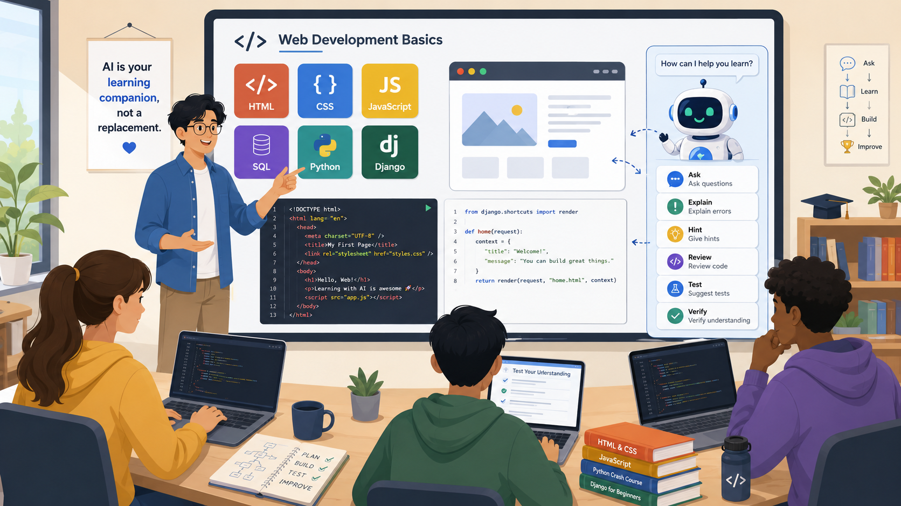

# We Should Stop Pretending Students Won’t Use AI While Learning to Code

We should stop pretending students won’t use AI while learning to code. They will.

Some already do. Some use it carefully. Some use it badly. Some paste in the assignment and accept whatever comes back. Some ask it to explain an error message and then go back to their own work. Some use it as a search engine, a tutor, a rubber duck, a code generator, a debugger, and occasionally as a very confident source of nonsense.

Trying to ban that reality from the classroom is unlikely to work. It also misses the more useful academic strategy. How do we as educators help learners use AI in ways that build skills and deeper understanding?

That is the question I held in my mind while writing my book, *Web Dev with an AI Sidekick*. The book is written for absolute beginners, but it assumes they are learning in the world as it is now. AI is already part of the environment. The task for teachers, colleges, bootcamps, librarians, course leaders, and parents is to help the young people in their lives make the best use of AI without skipping the learning.

## The old beginner problem has changed

Learning to code has always involved getting stuck and struggling a bit.

A missing bracket can break a program. A typo in a variable name can produce an error that looks more frightening than it is. A page can refuse to style correctly because one selector is wrong. A SQL query can return no rows because the learner misunderstood the data. A server can fail to start because the command was run from the wrong folder.

These moments are normal. They are also where many beginners lose confidence.

In the past, a learner might wait for a teacher, search forums, ask a classmate, or give up for the evening. AI changes that. A student can paste in the error and ask for an explanation. They can ask for a smaller example. They can ask, “What should I check first?” They can ask, “Explain this like I am new to programming.”

That can be helpful, but it can also be dangerous with good guidance.

If AI gives the student a full answer too soon, the student may complete the exercise without understanding it. If it rewrites the code in a style the course has not covered yet, the student may be unable to explain what they have submitted. If it invents an explanation, the student may learn the wrong lesson with complete confidence.

So the classroom problem is not the traditional, “How do we teach loops, functions, HTML forms, SQL queries, and HTTP requests?” It is now, “How do we teach students to ask for help from AI without handing over the thinking?”

## A realistic course companion

A good beginner book in the AI era should not pretend AI tools are absent. It should also not treat them as a shortcut around foundational knowledge. *Web Dev with an AI Sidekick* tries to sit in that middle ground.

My book teaches the web stack in stages. Students learn frontend foundations such as HTML, CSS, JavaScript, and TypeScript. They then learn backend foundations using Python, SQL, and Django. They use Bash for command-line work and automation. Then they bring the pieces together in a survey application.

Students are not asked to build a full application before they have met the parts. They are also not left with disconnected examples that never become anything larger. The book builds toward a project that shows how structure, presentation, browser behavior, data, backend logic, and developer tooling work together.

AI is present throughout that journey, but it has a role. It helps students ask questions, inspect code, compare alternatives, debug problems, and verify their understanding. It is not treated as an invisible ghostwriter leaving students with a black box that they don't understand.

For a teacher, that distinction is useful. It gives you language for class discussion. It gives you rules of thumb for assignments. It gives you ways to tell the difference between a student using AI to learn and a student using AI to avoid learning.

## The classroom question is use, not access

Many institutions are still trying to decide what their AI policy should be. That is understandable. There are serious concerns: plagiarism, assessment design, student dependency, inaccurate answers, data privacy, and uneven access. Some learners may have paid tools. Some may use free tools. Some may use no tools at all unless the institution provides them.

A student can follow a rule and still learn very little. Another student can use AI and learn a great deal, if the task is framed well.

Here is a simple classroom distinction: 

> Poor use of AI asks, “Give me the answer.” Better use asks, “Help me understand why my answer does not work.”

This is where teaching can make a real difference. Students need examples of acceptable AI use, not only warnings about unacceptable use.

## Guardrails students can understand

Absolute beginners need simple rules they can remember.

Here are some guardrails that work well in a course:

1. First, ask AI for explanations before asking for code. If a learner does not understand the problem, more code usually gives them more to misunderstand.

2. Second, ask for hints before full solutions. A hint keeps the learner in the task. A complete answer can end the learning too early.

3. Third, paste small pieces of code, not the whole project. A small example is easier to inspect and discuss.

4. Fourth, ask AI to explain the change it made. If the tool modifies code but the learner cannot describe the change, they are not finished.

5. Fifth, run the code and test the behavior. AI output is only a suggestion until the learner has checked it.

6. Sixth, keep a note of useful prompts. This turns AI use into a study habit rather than a panic button.

7. Seventh, never submit code you cannot explain. This is the bluntest rule and probably the most useful one.

These guardrails are simple enough for beginners, but they are not childish. Professional developers need similar habits. The difference is that experienced developers have more background knowledge to catch mistakes.

## Prompt patterns that build understanding

Many students need help with the first sentence. They know they are stuck, but they do not know how to ask a useful question. That is especially true in programming, where the learner may not know whether the problem is syntax, logic, data, tooling, or misunderstanding the task.

A beginner-friendly course can give students prompt patterns that steer them toward learning.

## Review habits matter more than prompt tricks

Prompting gets a lot of attention, but review habits matter more. Students need to learn what to do after AI responds.

A useful response should be checked. Does the explanation match the code? Is the suggested fix small or has it rewritten half the exercise? Does it use features the student has not learned yet? Does it solve the stated problem, or a nearby problem? Does it introduce a dependency, package, or pattern the course has not introduced?

Students can learn to ask those questions. They need to see them modeled. That sort of demonstration is more valuable than a rule saying “AI allowed” or “AI banned.” It shows judgment. It also shows students that reviewing AI output is part of the work.

## Exercises should make thinking visible

If students can use AI, then assignments need to ask for more than a final answer. This does not mean every exercise must become longer. It means the exercise should reveal how the student approached the problem.

For example, an assignment might ask students to include:

- A short explanation of what their code does.

- One error they encountered and how they diagnosed it.

- One AI prompt they used, if they used AI.

- One AI suggestion they rejected and why.

- One test they ran to check the behavior.

- One thing they still find confusing.

These additions are small, but they change the task. They make it harder for a student to paste in a finished answer and learn nothing. A learner who used AI well should be able to describe their decisions. A learner who used AI badly often cannot.

For colleges and bootcamps, this matters because assessment has to adapt. If AI can produce code, the course has to value explanation, testing, debugging, and revision alongside code completion.

## Why this matters for absolute beginners

Absolute beginners are vulnerable to two opposite mistakes.

The first mistake is fear. They think everyone else understands programming instantly, while they are the only person confused by error messages, setup problems, and code that refuses to behave.

AI can help with that. It can explain the same idea three different ways. It can give a smaller example. It can help a learner recover from a tiny mistake that would otherwise stop them for the day.

The second mistake is dependence. They ask AI for answers so often that they never build the habit of reading code carefully. They finish exercises without gaining confidence. The work looks complete, but the understanding is thin.

That is why the sidekick metaphor is useful for education. A sidekick can help. A sidekick should not take over the story.

The learner still has to write, read, test, question, and explain.

A beginner who uses AI well may get unstuck faster. They may ask better questions. They may see more examples. They may build a stronger connection between the code and the behavior of the application.

But that only happens when the course expects them to think.

## A book for the AI-era classroom

*Web Dev with an AI Sidekick* is designed to be useful as a course companion because it accepts the reality of AI use while keeping the focus on learning.

It gives students a structured path through the web stack.

It builds toward a complete survey project.

It treats debugging and verification as normal parts of development.

It gives learners ways to use AI without surrendering their judgment.

For teachers, colleges, bootcamps, librarians, and course leaders, that makes the book easier to place in a beginner course. It can support classroom teaching, self-study, guided labs, library recommendations, and project-based learning.

The book does not assume that AI makes web development effortless. That would be a poor message for students.

A better message is this:

> Web development is still a serious subject. Students still need foundations. They still need practice. They still need feedback. They still need to explain what their code does.

By giving learners another way to ask questions, debug problems, test ideas, and check whether they understand what they are building. That is the classroom opportunity.

The students are going to use AI. We should teach them how to use it well.

Book link: https://www.amazon.com/dp/180611125X/
