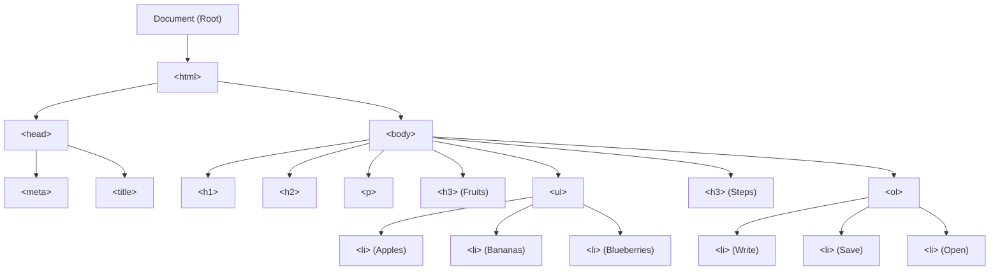

> **Prompt**: Please show me the HTML for a basic webpage with examples of headings, paragraphs, and lists, so that I can learn about how web pages are structured, with an explanation of all the elements.

Building a webpage starts with understanding the "skeleton" of the document. HTML (HyperText Markup Language) uses **tags** to tell the browser what each piece of content is.

Here is a breakdown of a standard, well-structured HTML page.

### The Basic HTML Structure

```html
<!DOCTYPE html>
<html lang="en">
<head>
    <meta charset="UTF-8">
    <title>My Learning Page</title>
</head>
<body>

    <h1>Welcome to My First Webpage</h1>
    <h2>About This Project</h2>
    
    <p>This is a paragraph. It is used for blocks of text. HTML ignores 
    extra spaces or line breaks inside the code, so we use tags to 
    structure the flow.</p>

    <h3>My Favorite Fruits (Unordered List)</h3>
    <ul>
        <li>Apples</li>
        <li>Bananas</li>
        <li>Blueberries</li>
    </ul>

    <h3>Steps to Code (Ordered List)</h3>
    <ol>
        <li>Write the HTML</li>
        <li>Save the file as .html</li>
        <li>Open it in a browser</li>
    </ol>

</body>
</html>

```

---

### Understanding the Elements

To understand how these pieces fit together, it helps to visualize the **Document Object Model (DOM)**, which is the tree-like structure browsers use to organize these tags.

Here is what each tag actually does:

| Tag | Name | Description |
| --- | --- | --- |
| `<!DOCTYPE html>` | Document Type | Tells the browser this is a modern HTML5 document. |
| `<html>` | Root Element | The "container" for everything on the page. |
| `<head>` | Metadata | Contains info *about* the page (like the title) that doesn't show up on the screen. |
| `<body>` | Body | Contains all the visible content: text, images, and links. |
| `<h1>` to `<h6>` | Headings | `<h1>` is the most important (main title), `<h6>` is the least. |
| `<p>` | Paragraph | Defines a block of text with some space above and below it. |
| `<ul>` | Unordered List | Creates a bulleted list. |
| `<ol>` | Ordered List | Creates a numbered list. |
| `<li>` | List Item | The individual items inside a `<ul>` or `<ol>`. |

---

### A Note on "Nesting"

In HTML, tags are usually "nested." For example, you cannot have a `<li>` (list item) just floating around by itself; it must be wrapped inside a "parent" tag like `<ul>` or `<ol>`. This hierarchy is what gives a webpage its logical structure.

### A Mermaid diagram of the DOM

To visualize how a web browser sees your page, we use a **DOM (Document Object Model) Tree**. This diagram shows the "parent-child" relationship between the different elements.

Here is the Mermaid markup for the example webpage provided earlier:



### Key Takeaways from the Diagram:

* **The Root:** The `<html>` tag is the parent of everything else.
* **Siblings:** The `<head>` and `<body>` are siblings because they sit at the same level under the same parent.
* **Nesting:** You can see how the `<li>` (list items) are "children" of the `<ul>` or `<ol>` tags. In HTML, we say that the list items are **nested** inside the list container.