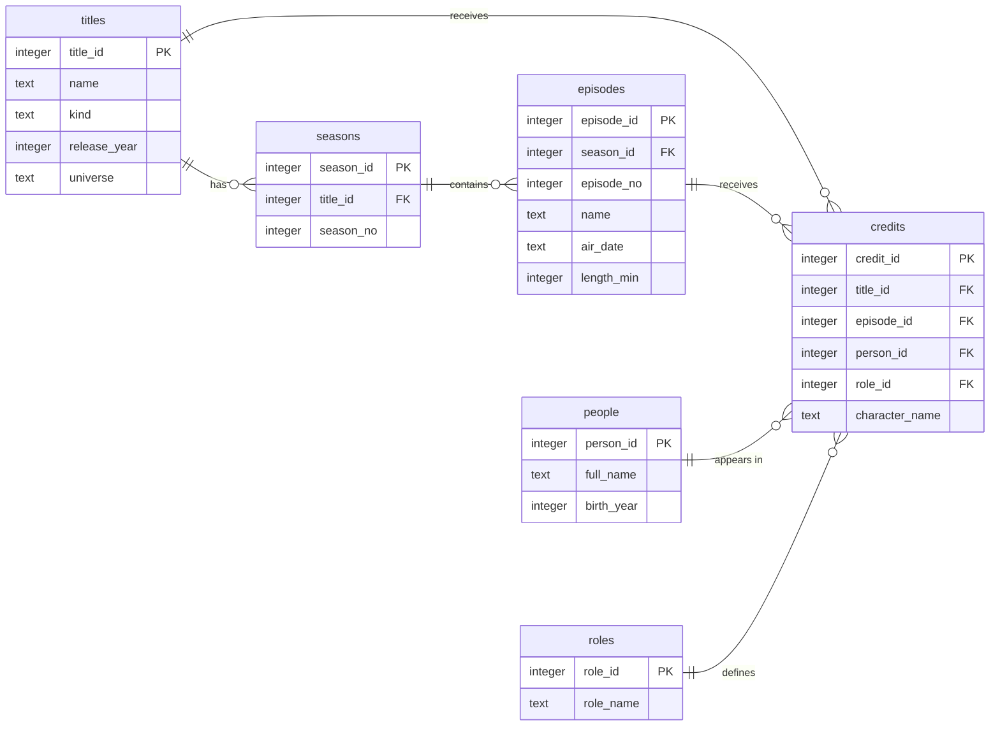

> **Prompt**: Please create a Mermaid Entity-Relationship diagram drawn left-to-right for this database based on the attached SQL script.

Based on the `Media.sql` script provided, here is the Mermaid Entity-Relationship diagram illustrating the structure of your database.

This diagram reflects the relationships defined by the **FOREIGN KEY** constraints and the categorization of entities such as titles, people, and roles.

---

### Key Structural Insights

* **Central Hub:** The `credits` table acts as a many-to-many join table connecting `titles`, `people`, and `roles`.
* **Hierarchical Chain:** There is a clear "Series → Season → Episode" hierarchy.
* **Flexible Credits:** The `credits` table allows for a person to be credited at the **Title** level (like a movie star) or the **Episode** level (like a guest star) by making `episode_id` nullable.
* **Integrity Rules:** The script uses `ON DELETE CASCADE` for all foreign keys, meaning if you delete a `title`, all associated `seasons`, `episodes`, and `credits` will be automatically removed.

